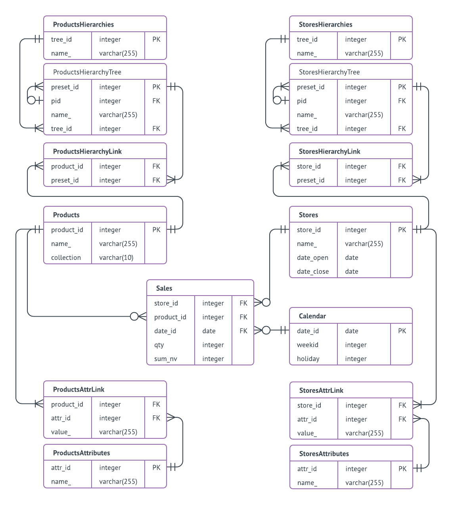
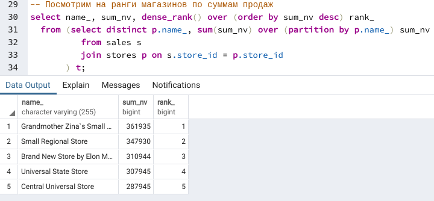
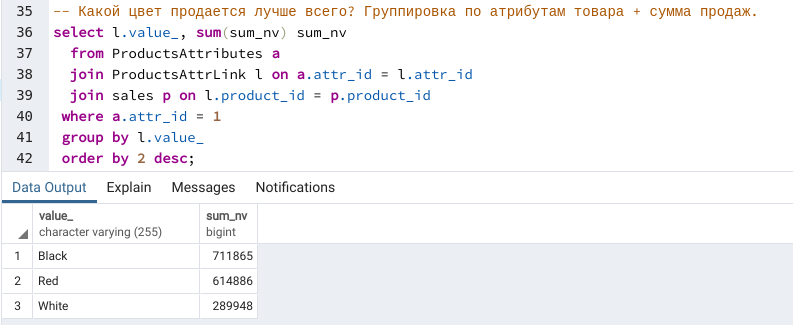
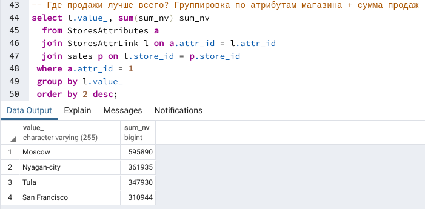
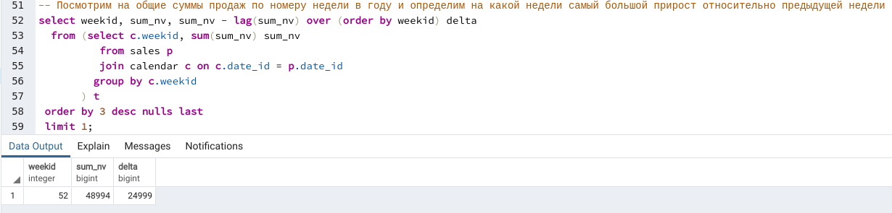
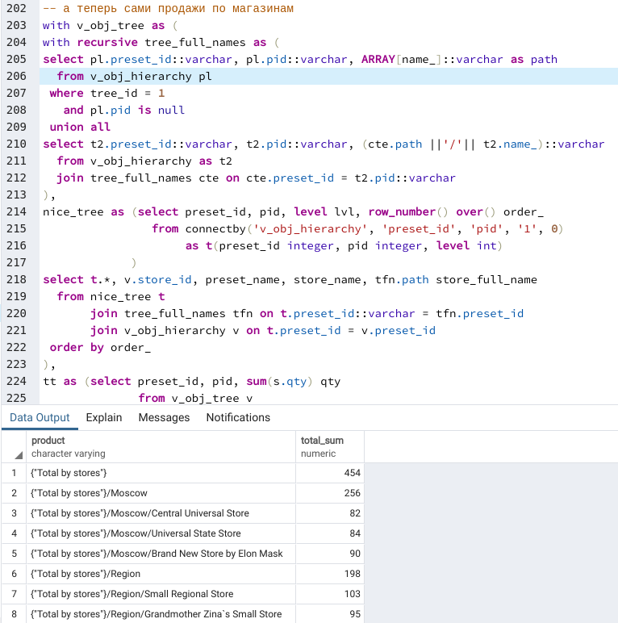

# Проектная работа по модулю “SQL и получение данных”

### Что необходимо сделать?
 							
1. Создать не менее 4 таблиц и заполнить их данными. 
Таблицы должны быть связаны между собой посредством ключей (ID) и представлять какую-то логическую структуру. 
Тематика данных может быть использована любая
2. Написать не менее 10 SQL запросов к базе данных. 
В запросах должны быть отражены как базовые команды, так и аналитические функции (не менее 3 запросов). 
Должно присутствовать описание того, что вы получаете путем каждого запроса.


### Как сдавать проектную работу?

По итогам работы у вас должны быть подготовлены следующие файлы:						
- Описание БД, ее таблиц, логики, связей и бизнес области (формат .pdf)
- Список SQL запросов с их описанием (формат .sql)


```python
from IPython.display import Image
```

***
## В качестве бизнес-области для проектной работы взята модель продаж.
-  Продажи товаров (product_id) осуществляются в магазинах (store_id) в течении всего года (date_id = день) в штуках (qty) и национальной валюте (РУБЛИ, sum_nv).
    -  Детализация: магазин - товар - день
-  Товар является элементом справочника Products.
    -  У товара есть атрибуты (attr_id) ProductsAttributes (связь через link-таблицу ProductsAttrLink)
    -  Товарные иерархии ProductsHierarchyTree (справочник иерархий товара ProductsHierarchies) позволяют анализировать товар в различных преднастроенных деревьях
-  Магазин является элементом справочника Stores
    -  У магазина есть атрибуты StoresAttributes (связь через link-таблицу StoresAttrLink)
    -  Магазинные иерархии StoresHierarchyTree (справочник иерархий магазинов StoresHierarchies) позволяют анализировать магазины в различных преднастроенных деревьях
-  Дата является элементом календаря, простейший вариант которого включает лишь номер недели, год и признак выходного дня

Скрипт создания таблиц и наполнения данными [здесь](https://github.com/VladimirNikiforov/netology-ds/blob/master/sql/sql/project_ddl_dml.sql)



## В схеме 14 таблиц, кратко описывающих бизнес-модель продаж товара в магазинах
Все названия вымышленные и связи с действительностью не имеют... :)

### Запрос 1. В рабочие или выходные дни в среднем больше покупают штук товаров?


### Запрос 2. Сколько всего мы выручили рублей за каждый из наших товаров?


### Запрос 3. Какой из магазинов больше продает в рублях?



### Запрос 4. Какой цвет среди всех товаров самый продаваемый?



### Запрос 5. В каких городах больше продажи?



### Запрос 6. Какая неделя "пиковая" - максимальный рост продаж относительно предыдущей недели?



### Запрос 7. Для каждого из магазинов найдем самый продаваемый товар - bestseller


### Запрос 8. Построим товарную иерархию с товарами


### Запрос 9. Сама по себе товарная иерархия - хорошо, но добавим продажи!


### Запрос 10. Построим магазинную иерархию с объемами продаж и расчетом агрегатов на верхних уровнях иерархии




Полные скрипты доступны в [здесь](https://github.com/VladimirNikiforov/netology-ds/blob/master/sql/sql/project.sql)
